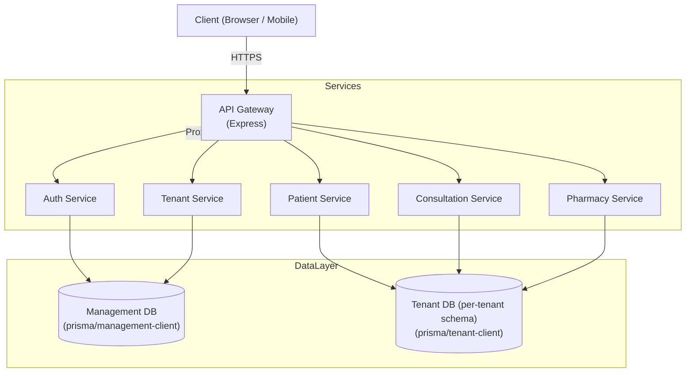

# PHC Commons : Platform for Health Care Centers

<div align="center">

 [](https://to_be_updated.com)

**Manage your PHC in a Smarter Digital way under one place**

*We take care of the documentation — so that you can focus more on caring*


[Live Demo](https://example.com) • [Documentation](./docs/saas_guide.md) • [Architecture](./docs/system_design.md) • [Contributing](CONTRIBUTING.md)

</div>

# What is PHC Commons?

A comprehensive Hospital Management System (HMS) designed for Primary Health Centres (PHCs) in India. This platform enables efficient patient management, consultation tracking, pharmacy inventory, and reporting, with a focus on usability and offline-first capabilities.


## Features
- **Multi-Tenant Architecture**: Supports multiple PHCs with data isolation.
- **Role-Based Access Control (RBAC)**: Granular permissions for Doctors, Nurses, Pharmacists, ASHAs, and Admins.
- **Patient Management**: Registration (ABHA ID integration), Vitals recording, and History tracking.
- **Consultation**: Digital diagnosis, prescription generation, and voice-to-text notes (planned).
- **Pharmacy**: Inventory management, batch tracking, and low-stock alerts.
- **Smart Triage**: Automated risk scoring based on vitals.
- **OCR Integration**: Scan medical reports and IDs for quick data entry.


## How it's built?  The Tech Stack Behind PHC Commons

- **Frontend**: React, Vite, Tailwind CSS
- **Backend**: Node.js, Express (Microservices)
- **Database**: PostgreSQL (Supabase), Prisma ORM
- **Infrastructure**: Docker, Nginx/Express Gateway


## Architecture Overview

The platform follows a microservices architecture with schema-based multi-tenancy on PostgreSQL. An API Gateway routes requests to smaller services (auth, tenant management, patient, consultation, pharmacy, etc.).




## Getting Started

### Prerequisites
- Node.js (v18+)
- Docker & Docker Compose
- PostgreSQL (or Supabase account)

### Local Development
1.  **Clone the repository**:
    ```bash
    git clone https://github.com/p4r1ch4y/phc_platformcommons.git
    cd phc_platformcommons
    ```

2.  **Install dependencies**:
    ```bash
    npm install
    ```

3.  **Setup Environment Variables**:

    Create `.env` in repo root with at least:

    ```env
    DATABASE_URL="postgresql://<user>:<pass>@<host>:5432/<db>"
    JWT_SECRET="your_jwt_secret"
    ```

    
    - Copy `.env.example` to `.env` (if available) or create one based on `packages/database/.env`.
    - Ensure `DATABASE_URL` points to your Postgres instance.


4. Start services (all in dev mode)

```bash
npm run dev
```

4.  **Run Database Migrations**:
    ```bash
    npx prisma migrate dev --schema=packages/database/prisma/schema.prisma
    ```

5.  **Start Services**:
    ```bash
    npm run dev
    ```
    This starts all microservices and the frontend concurrently.

### Deployment

#### Docker (Local/VPS)
```bash
docker-compose up --build -d
```

#### Render (Cloud)
This repository includes a `render.yaml` blueprint for easy deployment on Render.
1.  Connect your GitHub repository to Render.
2.  Select "Blueprints" and choose this repo.
3.  Render will automatically detect the `render.yaml` and prompt for environment variables.

## Documentation
- [Architecture Overview](docs/architecture.md)
- [API Reference](docs/api_reference.md)
- [SaaS Guide](docs/saas_guide.md)

## Contributing
Please read the [Contribution Guidelines](CONTRIBUTING.md) before submitting a Pull Request.
