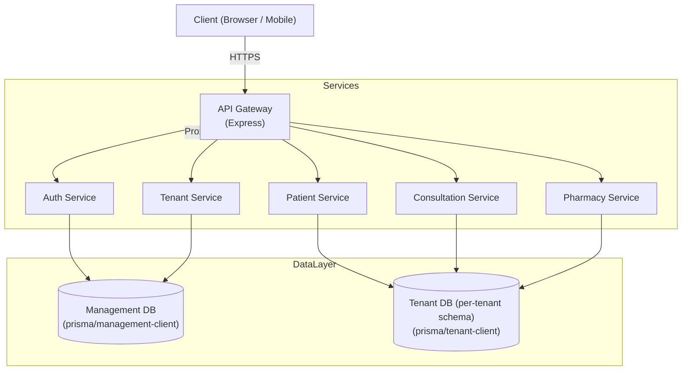
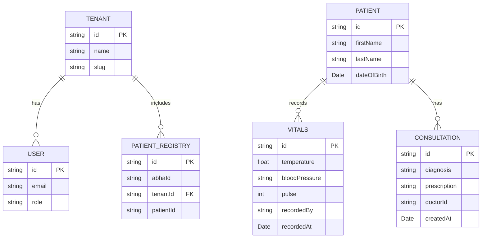

# System Design — PHC HMS

This document explains the high-level architecture of PHC Commons, the request flow, and the data model. It includes diagrams (Mermaid) that illustrate system components and relationships.

## Architecture Overview

The platform follows a microservices architecture with schema-based multi-tenancy on PostgreSQL. An API Gateway routes requests to smaller services (auth, tenant management, patient, consultation, pharmacy, etc.).



## Request Flow

1. Client authenticates via `/auth/login`. `Auth Service` returns a JWT containing `userId`, `roles`, and `tenantId`/`tenantSlug`.
2. Client calls endpoints on the API Gateway. Gateway validates JWT and forwards to the appropriate service.
3. Backend services extract tenant context from the token or `x-tenant-slug` header and instantiate a tenant-scoped Prisma client (schema-based connection).
4. Services perform reads/writes against either the Management DB (global data like Tenants, Users) or the Tenant DB (per-tenant schemas for Patients, Vitals, Consultations, Medicines).

## Data Model (High level)



## Operational considerations

- Schema provisioning: `Tenant Service` runs migrations or pushes schema for each tenant (scriptable via Prisma).
- Backups & data retention: manage backups at DB level (Supabase / Postgres snapshots).
- Security: avoid logging secrets; enforce RBAC checks in middleware; use short-lived JWTs and refresh tokens.

## References

- Prisma multi-schema patterns: use dynamic `DATABASE_URL` or `search_path` to scope tenant schema.
- See `packages/database/prisma/*.prisma` for schema definitions.
# System Design - PHC Hospital Management System

## Architecture Overview

The system follows a **Microservices Architecture** with a **Multi-tenant Database** strategy using PostgreSQL Schemas.

```
graph TD
    Client[Client (Web/Mobile)] --> Gateway[API Gateway (Express)]
    
    subgraph "Core Services"
        Gateway --> Auth[Auth Service]
        Gateway --> Tenant[Tenant Service]
        Gateway --> Patient[Patient Service]
        Gateway --> Consult[Consultation Service]
    end
    
    subgraph "Data Layer"
        Auth --> DB[(PostgreSQL)]
        Tenant --> DB
        Patient --> DB
        Consult --> DB
    end
        string id PK
        string slug "Schema Name"
        string name
    }
    User {
        string id PK
        string email
        enum role "ADMIN, DOCTOR, NURSE"
    }

    %% Tenant Schema (Repeated per Tenant)
    Patient ||--|{ Vitals : "has"
    Patient ||--|{ Consultation : "has"
    Patient {
        string id PK
        string name
        date dob
    }
    Consultation {
        string id PK
        string diagnosis
        string prescription
    }
```

## Request Flow

1. **Authentication**: User logs in via `Auth Service` and receives a JWT containing `userId`, `role`, and `tenantId`.
2. **Routing**: `API Gateway` forwards requests to appropriate services.
3. **Context Propagation**: Services extract `tenantId` (slug) from headers or token.
4. **Data Access**: Services use a dynamic `PrismaClient` configured with the specific tenant schema URL (`postgres://...?schema=tenant_slug`).

## Tech Stack

- **Backend**: Node.js, Express, TypeScript
- **Database**: PostgreSQL, Prisma ORM
- **Containerization**: Docker, Docker Compose
- **Workspace**: npm workspaces (Monorepo)
